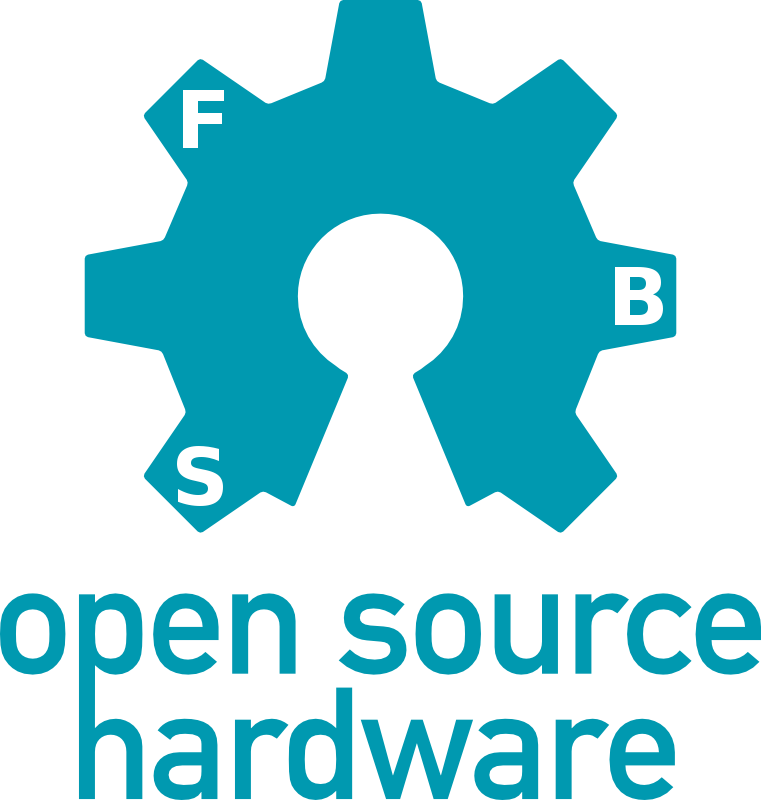

# Orgone-accumulator DIY3
PRELIMINARY INFO

Google sheets BOM:
https://docs.google.com/spreadsheets/d/1yWP0SEDUn4MFoWlR4tSw32LnQw3czUZVgWfFrcoWUo0

buy bare boards and/or PCBpanels (black)  
prices are canadian dollars. currently about 0.7 USD  
includes airmailing to your location. 
# please note what you bought in paypal message!  

board Canada $30 https://paypal.me/neutronsound/30  
panel Canada $25 : out of stock 
board + panel Canada $45 : out of stock 

board U.S. $35 https://paypal.me/neutronsound/35  
panel U.S. $30 : out of stock 
board + panel U.S. $50 : out of stock  

board International $40 https://paypal.me/neutronsound/40  
panel International $35 : out of stock 
board + panel International $55 : out of stock 

Build Guide by Mark Thomson:  
https://drive.google.com/open?id=1N__tNIBf6pU2vMjDG5RvQLvu772NAHjN  

**changed from previous through hole DIY orgones:**

* SMD components (easy soic and 0805)
* option for linear or switching regulator with pi filter.
* "PSI POWER" either way power header via rectifier.

**improvements to circuit:**
* strong transient PWM signal from sub output is routed away from
everything else and has its own op-amp.
* changed CV inputs to use single rail RRIO op amps and no longer require the protection diodes
* changed vref. it is powered on when the teensy LED it lit up, so there is no voltage on the teensy inputs while booting.

This version uses the same code as previous DIY and retail orgones.
 recommended is "144mhz overclock" 
 
boards.txt in [arduinofolder]/hardware/teensy/avr 
must be edited to make 144mhz available.(uncomment appropriate line)

- [ ]mouser BOM
- [*]google BOM
- [*]Build guide
- [*]OSH logo
